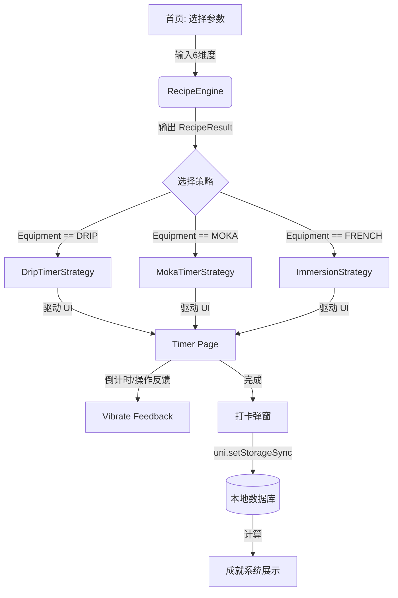

# 居家咖啡制作助手 (Home Barista) 系统架构设计方案

## 1. 项目目录树规范

遵循 Uni-app (Vue 3 + TS) 的标准结构，并针对业务逻辑进行模块化拆分：

```text
frontend/src/
├── components/             # 公共组件
│   ├── BrewStepCard.vue    # 步骤显示卡片
│   ├── AchievementToast.vue# 成就达成提示
│   └── FinishModal.vue     # 冲煮结束打卡弹窗
├── constants/              # 业务常量配置
│   ├── equipment.ts        # 器具列表及默认参数
│   └── coffee.ts           # 豆种、烘焙度枚举
├── hooks/                  # 组合式 API (Logic Reuse)
│   ├── useTimer.ts         # 核心计时计时逻辑
│   └── useVibrate.ts       # 震动反馈封装
├── pages/                  # 页面布局
│   ├── index/index.vue     # 首页：智能参数配置
│   ├── timer/timer.vue     # 计时器页：多模态适配
│   └── profile/profile.vue # 个人中心：本地打卡与成就
├── store/                  # 状态管理 (Pinia)
│   ├── brew.ts             # 当前冲煮任务状态
│   └── user.ts             # 用户偏好与成就数据
├── types/                  # TypeScript 类型定义
│   ├── coffee.ts           # 咖啡豆与基础属性类型
│   ├── brew.ts             # 冲煮步骤与引擎输出类型
│   └── timer.ts            # 计时器策略接口
├── utils/                  # 工具函数
│   ├── recipeEngine.ts     # 核心：冲煮参数推导引擎
│   ├── timerStrategies.ts  # 核心：各器具计时策略实现
│   └── storage.ts          # 本地缓存持久化封装
└── pages.json              # 路由配置
```

## 2. TypeScript 多态类型建模 (`src/types/brew.ts`)

核心思路：利用 **可辨识联合类型 (Discriminated Unions)** 来处理不同器具完全不同的步骤结构。

```typescript
// 器具类型枚举
export enum EquipmentType {
  Drip = 'DRIP',           // 手冲
  MokaPot = 'MOKA_POT',    // 摩卡壶
  FrenchPress = 'FRENCH',  // 法压
  ColdBrew = 'COLD_BREW'   // 冷萃
}

// 基础步骤接口
interface BaseStep {
  type: string;
  label: string;
  duration?: number; // 持续时间（秒）
  vibrate?: boolean; // 是否触发震动
}

// 1. 手冲步骤：强调注水量
export interface PourOverStep extends BaseStep {
  type: 'POUR';
  targetWeight: number; // 目标达到克重
  description: string;  // 如 "绕圈注水"
}

// 2. 摩卡壶步骤：强调状态观察
export interface MokaStep extends BaseStep {
  type: 'OBSERVE';
  indicator: 'FIRST_DROP' | 'BUBBLING' | 'OFF_FIRE'; // 关键状态点
}

// 3. 浸泡步骤：简单计时
export interface ImmersionStep extends BaseStep {
  type: 'WAIT';
}

// 统一的步骤联合类型
export type BrewStep = PourOverStep | MokaStep | ImmersionStep;

// 引擎输出结果
export interface RecipeResult {
  equipment: EquipmentType;
  grindSize: string;      // 研磨度建议
  waterTemp: number;      // 建议水温
  ratio: string;          // 粉水比
  totalWater: number;     // 总注水量
  steps: BrewStep[];      // 针对该器具生成的流程树
}
```

## 3. 参数推导与计时器策略模式设计

### 3.1 决策引擎 (`recipeEngine.ts`)

引擎根据输入的 6 个维度，通过查表或简单算法计算出结果。

```typescript
export const calculateRecipe = (input: BrewInput): RecipeResult => {
  // 1. 根据器具确定基础步骤模版
  // 2. 根据烘焙度微调水温 (深烘低温，浅烘高温)
  // 3. 根据豆种与款式微调粉水比
  // 4. 生成具体的 BrewStep[]
};
```

### 3.2 计时器策略实现 (`timerStrategies.ts`)

通过策略模式处理计时界面的动态行为：

```typescript
export interface TimerStrategy {
  onStart(): void;
  onTick(elapsed: number): void;
  onStepChange(stepIndex: number): void;
  isFinished(): boolean;
  getDisplayData(): any; // 返回当前界面需要渲染的特有数据 (如：当前目标克重)
}

// 实现类示例
export class DripTimerStrategy implements TimerStrategy {
  // 实现手冲特有的：克重累加逻辑、阶段切换逻辑
}

export class MokaTimerStrategy implements TimerStrategy {
  // 实现摩卡壶特有的：状态触发逻辑
}
```

## 4. 页面间通信与路由设计 (`pages.json`)

由于是离线应用且不涉及后端，页面间通信通过 **URL 参数 + Pinia/GlobalState** 结合：

1.  **首页 -> 计时器页**：
    - 路由：`uni.navigateTo({ url: '/pages/timer/timer' })`
    - 数据：将引擎计算好的 `RecipeResult` 存入 Pinia 的 `brewStore`，计时器页直接从 Store 读取。
2.  **计时器页 -> 打卡弹窗**：
    - 组件内通信，完成后将数据通过 `Storage` 模块写入本地缓存。

```json
{
  "pages": [
    {
      "path": "pages/index/index",
      "style": { "navigationBarTitleText": "参数配置" }
    },
    {
      "path": "pages/timer/timer",
      "style": { "navigationBarTitleText": "正在冲煮" }
    },
    {
      "path": "pages/profile/profile",
      "style": { "navigationBarTitleText": "我的咖啡馆" }
    }
  ]
}
```

## 5. 系统交互流程 (Mermaid)



## 6. 分步执行路线图 (Milestones)

1.  **Phase 1: 类型与数据底层 (Types & Constants)**
    - 完成 `types/coffee.ts` 与 `types/brew.ts`。
    - 定义静态配置表。
2.  **Phase 2: 决策引擎开发 (Engine Logic)**
    - 实现 `recipeEngine.ts` 及其单元测试。
    - 确保不同输入能准确输出对应的 `BrewStep[]`。
3.  **Phase 3: 计时器核心框架 (Timer Framework)**
    - 开发计时器策略接口与基础计时 Hook (`useTimer`)。
    - 实现手冲模式的 UI 与逻辑。
4.  **Phase 4: 多模态适配 (Multi-mode Support)**
    - 依次实现摩卡壶、法压壶、冷萃的专属计时策略与 UI 表现。
5.  **Phase 5: 持久化与成就 (Storage & Achievements)**
    - 封装 Storage 工具。
    - 实现成就计算逻辑与个人中心页面。
6.  **Phase 6: 体验优化**
    - 添加震动反馈、动画过渡。
